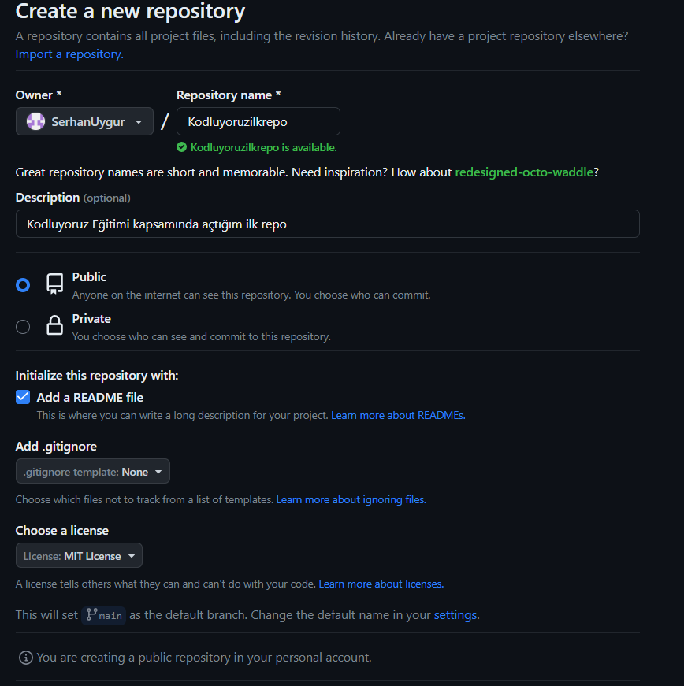

# Kodluyoruz Ilk Repo

Bu repo [Kodluyoruz](https://kodluyoruz.org) Front-End Eğitiminde oluşturdugumuz ilk repo.İçerisinde bir adet README dosyası,bir adet de index.html barındırıyor.



## Insatallation 

Öncelikle projeyi clone'layın.(Buraya sizin reponuzdan aldıgınız link gelecek)

```
git clone https://github.com/SerhanUygur/kodluyoruzilkrepo.git

```

## Usage

Projeyi cloneladıktan sonra Vısual Studio programında açınız 

Linux için : 

```
cd kondluyoruzilkrepo
code.
```

## Contrubuting 

Pull requestler kabul edilir.Büyük değişiklikler için,lütfen önce değiştirmek istediğinizi tartışmak için bir konu açınız.

## Licence 

[MIT](https://choosealicense.com/licenses/mit/)

